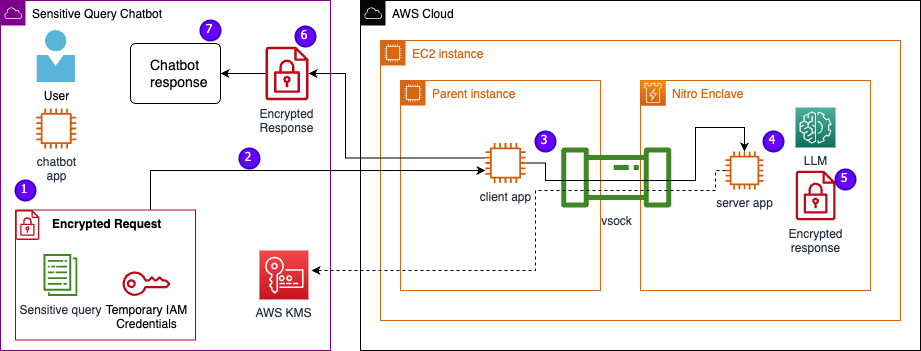

# AWS Nitro Enclave Large Language Models

This project contains an example implementation of how Nitro Enclaves can help protect LLM model deployments, specifically those that use personally identifiable information (PII) or protected health information (PHI). This post is for educational purposes only and should not be used in production environments without additional controls.

## Architecture

User data, including PII, PHI, and questions, remains encrypted throughout the request-response process when the application is hosted within an enclave. The steps carried out during the inference are as follows:

1. The chatbot app generates temporary AWS credentials and asks the user to input a question. The question, which may contain PII or PHI, is then encrypted via AWS KMS. The encrypted user input is combined with the temporary credentials to create the encrypted request.

2. The encrypted data is sent to an HTTP server hosted by Flask as a POST request. Before accepting sensitive data, this endpoint should be configured for HTTPs.

3. The client app receives the POST request and forwards it through a secure local channel (for example, vsock) to the server app running inside Nitro Enclaves.

4. The Nitro Enclaves server app uses the temporary credentials to decrypt the request, queries the LLM, and generates the response. The model-specific settings are stored within the enclaves and are protected with cryptographic attestation.
5. The server app uses the same temporary credentials to encrypt the response.

6. The encrypted response is returned back to the chatbot app through the client app as a response from the POST request.

7. The chatbot app decrypts the response using their KMS key and displays the plaintext to the user.

## Environment Setup

# Before we get started, you will need the following prerequisites to deploy the solution:
1.	AWS account
2.	AWS Identity and Access Management (IAM) user

# Create an AWS KMS CMK
1.	Log in to the AWS Management Console and select the AWS region where you’d like to deploy these resources.
2.	Navigate to the AWS KMS by searching for “KMS” in the AWS Management Console search bar.
3.	Go to “Customer managed keys” located on the left tab.
4.	Click “Create key”
5.	Keep key type to “Symmetric” and key usage to “Encrypt and decrypt”.
6.	Input a key alias (this will be used later in the chatbot application). Add a description and tag your resources to associate them to this project.
7.	Defining key administrative permissions is optional.
8.	Defining key usage permissions is necessary, as the KMS key policy must give your IAM user key usage permissions.
9.	Review the key configurations and click finish.

# Create an EC2 Instance Role
1.	Navigate to the AWS IAM console by searching for “IAM” in the AWS Management Console search bar.
2.	In the navigation pane, choose “Roles” and then choose “Create role”.
3.	Select “AWS service” under the “Trusted entity type”.
4.	From the “Use case” dropdown, select EC2.
5.	On the “Name, review, and create” page, enter a role name. Add a description and tag to associate this IAM role to the project.
6.	Choose “Create role”.

# Create an AWS Cloud9 Environment
1.	Navigate to the AWS Cloud9 console by searching for "Cloud9" in the AWS Management Console search bar.
2.	Click “Create environment”.
3.	Provide an environment name and select “New EC2 instance”.
4.	Select any instance type.
5.	Under network settings, expand the “VPC settings”.
6.	Select the VPC and Subnet that are associated with the EC2 created above if they were built.
7.	Click “Create”.
8.	Attach the EC2 instance role to the Cloud 9 EC2 Instance
9.	Disable AWS managed temporary credentials from the Cloud9 settings

# Launch EC2 Instance
1.	Navigate to the Amazon EC2 by searching for “EC2” in the AWS Management Console search bar.
2.	Select “Launch instance”.
3.	Provide an appropriate EC2 instance name and select a QuickStart Amazon Machine Image (AMI) or create your own but ensure that selected AMI’s kernel driver is compatible with Nitro Enclaves distro kernels.
a.	For this demo, we are using the amzn2-ami-kernel-5.10-hvm-2.0.20230628.0-x86_64-gp2 AMI
4.	Select instance type.
a.	LLMs are very CPU- and memory-intensive. For this demo, we are using an r5.8xlarge instance.
5.	Configure key pair and network settings appropriately.
6.	Configure storage.
a.	LLMs are very large, so ensure that there is plenty of storage so you can load and save the model directly on the EC2 instance.
7.	Use the "Advanced details" dropdown to enable Nitro Enclaves.
8.	Once the instance is running, select the instance ID and navigate to the connect button at the top for ways to connect to your instance.

# EC2 Instance Configuration
Now that the EC2 instance is running and you have connected to your instance, use the following steps to configure the necessary Nitro Enclave tools:
1.	Install the Nitro Enclaves CLI to build and run Nitro Enclave applications:
` sudo amazon-linux-extras install aws-nitro-enclaves-cli -y `
` sudo yum install aws-nitro-enclaves-cli-devel -y `
2.	Verify installation of the Nitro Enclaves CLI:
` nitro-cli --version `
3.	Install Git and Docker to build docker images and download the application from GitHub. Add your instance user to the docker group (<USER> is your IAM instance user):
` sudo yum install git -y `
` sudo usermod -aG ne <USER> `
` sudo usermod -aG docker <USER> `
` sudo systemctl start docker && sudo systemctl enable docker `
4.	Start and enable the AWS Nitro Enclave allocator and vsock proxy services:
` sudo systemctl start nitro-enclaves-allocator.service && sudo systemctl enable nitro-enclaves-allocator.service `
` Sudo systemctl start nitro-enclaves-vsock-proxy.service && sudo systemctl enable nitro-enclaves-vsock-proxy.service `
AWS Nitro Enclaves use a local socket connection called vsock to create a secure channel between the parent instance and the enclave.
5.	Once all the services are started and enabled, restart the instance to ensure all user groups and services are running correctly.
` sudo shutdown -r now `

#Nitro Enclave Allocator Service
AWS Nitro Enclaves are an isolated environment that designates a portion of the instance CPU and memory to run the enclave. Using the Nitro Enclave allocator service, users can indicate how many CPUs and how much memory will be taken from the parent instance to run the enclave.
1.	Modify the enclaves reserved resources using any text editor (for our solution we allocate 8 CPU and 70000 MiB memory to ensure enough resources):
` vi /etc/nitro_enclaves/allocatory.yaml `

# Clone the Project
Once the EC2 instance is configured, you can download the code that will be used to run the sensitive chatbot with an LLM inside of a Nitro Enclave:
Note: You need to update the server.py file with the appropriate KMS key id that was created in the beginning to encrypt the LLM response.
1.	Clone the GitHub project:
cd ~/ && git clone https://<THE_REPO.git>
2.	Navigate to the project folder to build the “enclave_base” docker image that contains the Nitro Enclaves Software Development Kit (SDK) for cryptographic attestation documents from the Nitro Hypervisor (this step can take upwards to 15 minutes):
` cd /nitro_llm/enclave_base `
` docker build ./ -t “enclave_base” `

# Save the LLM in the EC2 Instance
We are using the open-source Bloom 560m large language model (LLM) for natural language processing to generate responses. This model is not fine-tuned to PII/PHI but demonstrates how a LLM can live inside of a Nitro Enclave. The model also needs to be saved on the parent instance so that it can be copied into the enclave via the Dockerfile.
1.	Navigate to the project:
` cd /nitro_llm `
2.	Install the necessary requirements to save the model locally:
` pip3 install requirements.txt `
3.	Run the save_model.py app to save the model within the /nitro_llm/enclave/bloom directory:
` python3 save_model.py `

# Build and Run the Nitro Enclave Image
To run Nitro Enclaves, an enclave image file (EIF) needs to be created from a docker image of your application. The Dockerfile located in the enclave directory contains the files, code, and LLM that will run inside of the enclave.
Note: Building and running the enclave will take multiple minutes to complete.
1.	Navigate to the root of the project:
` cd /nitro_llm `

2.	Build the enclave image file as enclave.eif
` nitro-cli build-enclave --docker-uri enclave:latest --output-file enclave.eif `

When the enclave is built, a series of unique hashes and platform configuration registers (PCRs) will be created. The PCRs are a contiguous measurement to prove the identity of the hardware and application. These PCRs will be required for cryptographic attestation and used during the KMS key policy update section below.

3.	Run the enclave with the resources from the allocator.service (adding the --attach-console argument at the end will run the enclave in debug mode):
` nitro-cli run-enclave --cpu-count 8 --memory 70000 --enclave-cid 16 --eif-path enclave.eif `
Note: You need to allocate at least 4 times the EIF file size. This can be modified in the allocator.service from pervious steps.

4.	You can verify the enclave is running with the command below:
` nitro-cli describe-enclaves `

# Update the KMS Key Policy
1.	Navigate to the Amazon KMS by searching for “KMS” in the AWS Management Console search bar.
2.	Go to “Customer managed keys” located on the left tab.
3.	Search for the key that you generated in the environment setup steps.
4.	Click “Edit” on the “Key policy”.
5.	Update the key policy with:
•	Your Account ID
•	Your IAM User Name
•	Updated Cloud9 Environment Instance Role
•	Actions kms:Encrypt and kms:Decrypt
•	Add enclave PCRs (e.g. “PCR0, PCR1, PCR2”) to your key policy with a condition statement

~~~~
{
    "Version": "2012-10-17",
    "Id": "key-default-1",
    "Statement": [
        {
            "Sid": "Enable User permissions",
            "Effect": "Allow",
            "Principal": {
                "AWS": "arn:aws:iam::<accountID>:user/<iamuser>"
            },
            "Action": "kms:*",
            "Resource": [
                "kms:CreateAlias", 
                "kms:CreateKey", 
                "kms:DeleteAlias", 
                "kms:Describe*", 
                "kms:GenerateRandom", 
                "kms:Get*", 
                "kms:List*", 
                "kms:TagResource", 
                "kms:UntagResource", 
                "iam:ListGroups", 
                "iam:ListRoles", 
                "iam:ListUsers"
            ]
        },
        {
            "Sid": "Enable Enclave permissions",
            "Effect": "Allow",
            "Principal": {
                "AWS": "arn:aws:iam::<accountID>:role/<cloud9instancerole>"
            },
            "Action": [
                "kms:Encrypt",
                "kms:Decrypt"
            ],
            "Resource": "*",
                "Condition": {
                    "StringEqualsIgnoreCase": {
                        "kms:RecipientAttestation:PCR0": "<PCR0>",
                        "kms:RecipientAttestation:PCR1": "<PCR1>",
                        "kms:RecipientAttestation:PCR2": "<PCR2>",
              }
        }
    ]
}
~~~~

# Save the Chatbot App
To mimic a sensitive query chatbot application that lives outside of the AWS account, the chatbot.py app needs to be saved and run inside of the Cloud9 environment. Your Cloud9 environment will use its instance role for temporary credentials to disassociate permissions from the EC2 running the enclave.

1.	Navigate to the AWS Cloud9 console by searching for "Cloud9" in the AWS Management Console search bar.
2.	Click “Open” next to your Cloud9 environment that was created in the begging setup steps.
3.	Copy the code below into a new file like “chatbot.py” into the main directory.
4.	Install required modules below:
` pip install boto3 `
` pip install requests `
5.	In the EC2 console grab the IP associated with your Nitro Enclave instance.
6.	Update the url variable in main http://<ec2instanceIP>:5001
chatbot.py

~~~~
"""
Modules for a basic chatbot like application and AWS communications
"""
import base64
import requests
import boto3

def get_identity_document():
    """
    Get identity document for current EC2 Host
    """
    identity_doc = requests.get(
        "http://169.254.169.254/latest/dynamic/instance-identity/document", timeout=30)
    return identity_doc

def get_region(identity):
    """
    Get account of current instance identity
    """
    region = identity.json()["region"]
    return region

def get_account(identity):
    """
    Get account of current instance identity
    """
    account = identity.json()["accountId"]
    return account

def set_identity():
    """
    Set region and account for KMS
    """
    identity = get_identity_document()
    region = get_region(identity)
    account = get_account(identity)
    return region, account

def prepare_server_request(ciphertext):
    """
    Get the AWS credential from EC2 instance metadata
    """
    instance_prof = requests.get(
        "http://169.254.169.254/latest/meta-data/iam/security-credentials/", timeout=30)
    instance_profile_name = instance_prof.text

    instance_prof_json = requests.get(
        f"http://169.254.169.254/latest/meta-data/iam/security-credentials/{instance_profile_name}",
        timeout=30)
    response = instance_prof_json.json()

    credential = {
        'access_key_id': response['AccessKeyId'],
        'secret_access_key': response['SecretAccessKey'],
        'token': response['Token'],
        'region': REGION,
        'ciphertext': ciphertext
    }
    return credential

def get_user_input():
    """
    Start chatbot to collect user input
    """
    print("Chatbot: Hello! How can I assist you?")
    user_input = input('Your Question: ')
    return user_input.lower()

def encrypt_string(user_input, alias, kms):
    """
    Encrypt user input using AWS KMS
    """
    file_contents = user_input
    encrypted_file = kms.encrypt(KeyId=f'alias/{alias}', Plaintext=file_contents)
    encrypted_file_contents = encrypted_file[u'CiphertextBlob']
    encrypted_file_contents_base64 = base64.b64encode(encrypted_file_contents)
    return encrypted_file_contents_base64.decode()

def decrypt_data(encrypted_data, kms):
    """
    Decrypt the LLM response using AWS KMS
    """
    try:
        ciphertext_blob = base64.b64decode(encrypted_data)
        response = kms.decrypt(CiphertextBlob=ciphertext_blob)
        decrypted_data = response['Plaintext'].decode()
        return decrypted_data
    except ImportError as e_decrypt:
        print("Decryption failed:", e_decrypt)
        return None

REGION, ACCOUNT = set_identity()

def main():
    """
    Main function to encrypt/decrypt data and send/receive with parent instance
    """
    kms = boto3.client('kms', region_name=REGION)
    alias = "ncsnitro"

    user_input = get_user_input()
    encrypted_input = encrypt_string(user_input, alias, kms)

    server_request = prepare_server_request(encrypted_input)

    url = ''
    x = requests.post(url, json = server_request)
    response_body = x.json()

    llm_response = decrypt_data(response_body["EncryptedData"], kms)
    print(llm_response)

if __name__ == '__main__':
    main()
~~~~

7.	Run the chatbot application:
` python3 chat.py `

8.	Once running, the terminal will ask for the user input and follow the architectural diagram from above to generate a secure response.

# Running the Private Question and Answer Chatbot

Now that the Nitro Enclave is up and running on the EC2 instance, you should be able to ask your chatbot PHI/PII questions. Here’s an example:
Within the Cloud9 IDE we ask our chatbot this question:

The KMS Service encrypts the question, and it will look like this:

It is then sent to the enclave and asked of the secured LLM. The question and response of the LLM will look like this:
Note: The result and encrypted response below are visible inside the enclave only in debug mode
The Result is then encrypted using KMS and is returned to the Cloud9 environment to be decrypted and will look like this:

# Cleaning Up
1.	Stop and terminate the EC2 instance created to house your Nitro Enclave.
2.	Delete the Cloud9 environment.
3.	Delete KMS Key.
4.	Remove EC2 Instance Role, IAM User Permissions.

## Security

See [CONTRIBUTING](CONTRIBUTING.md#security-issue-notifications) for more information.

## License

This library is licensed under the MIT-0 License. See the LICENSE file.